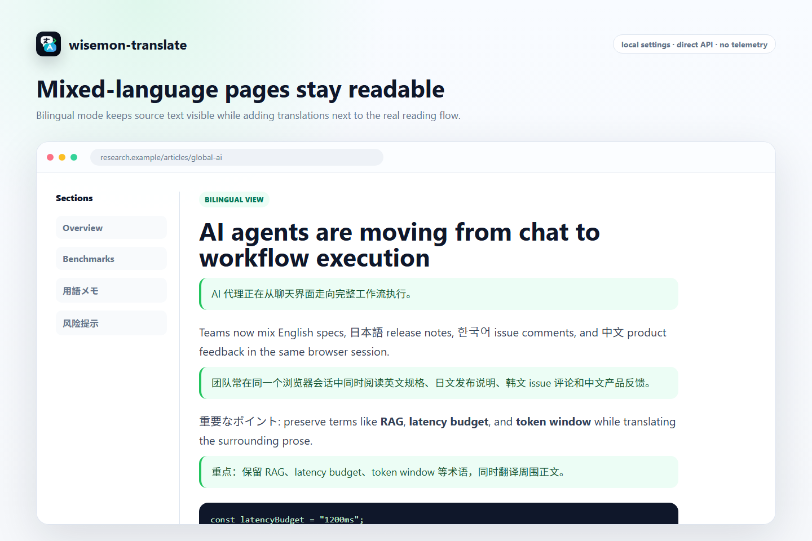
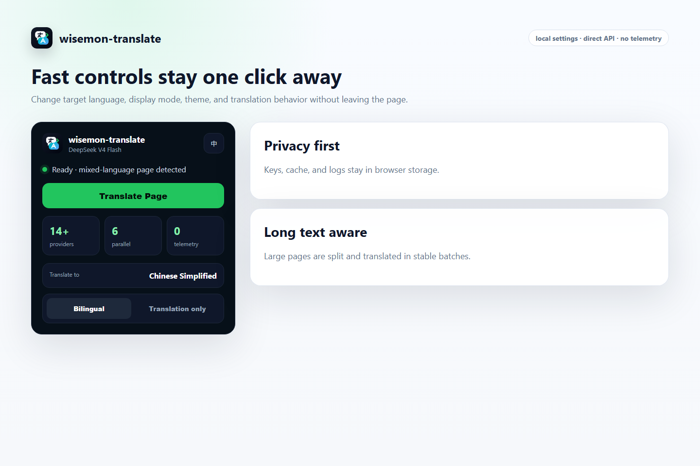
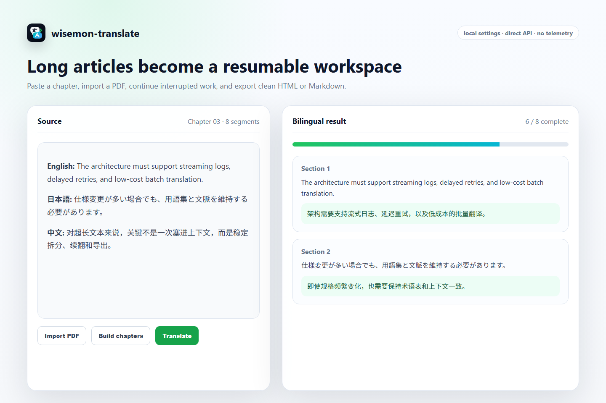
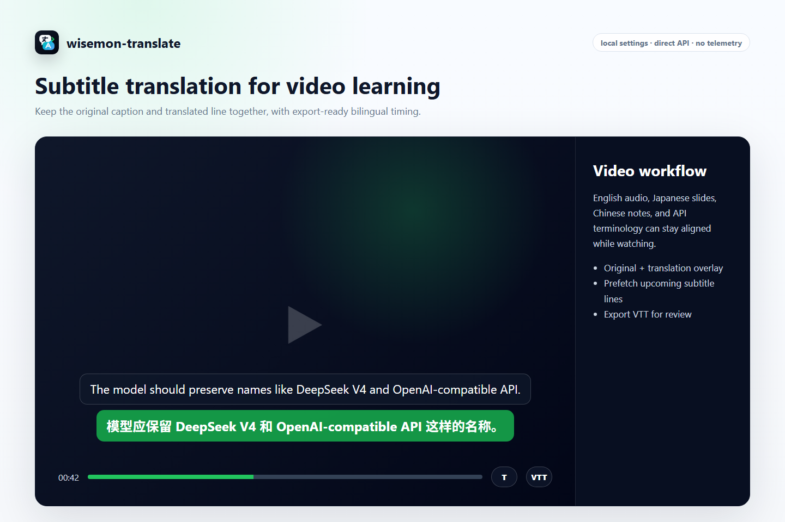

# wisemon-translate

<div align="center">
  
  <p><strong>Private bilingual translation for web pages, long text, PDFs, and YouTube subtitles.</strong></p>
  <p>
    <a href="./manifest.json"></a>
    <a href="./LICENSE"></a>
    <a href="./manifest.json"></a>
    <a href="./manifest-firefox.json"></a>
  </p>
  <p><a href="#english">English</a> | <a href="#中文">中文</a></p>
</div>



## English

wisemon-translate is an open-source browser extension for bilingual reading. It sends translation requests directly from your browser to the provider you configure. There is no relay server, no telemetry, and no bundled tracking.

### Highlights

- Page translation with layout-safe bilingual and translation-only display modes.
- Compact navigation, buttons, and menus are protected in bilingual mode to avoid breaking page layouts.
- Focused translation styles: Clean, Subtle Background, Divider Line, and Card.
- Side panel reader for pasted long text, TXT / HTML / PDF import, chapter-aware translation, failed-segment retry, and HTML / Markdown export.
- YouTube bilingual subtitle overlay with popup controls, track preference, nearby/full-video pre-translation, transcript panel, per-video cache, search, copy, multiple subtitle styles, and VTT export.
- Bring your own provider: DeepSeek, OpenAI, Anthropic, Gemini, OpenRouter, Ollama, Hunyuan HY-MT, LM Studio, DeepL, Baidu, Microsoft Translator, Google free translate, or any OpenAI-compatible endpoint.
- Privacy masking for emails, phone numbers, card numbers, verification codes, private keys, and URLs before requests are sent.
- Local-only settings, cache, and logs.

### Screenshots

| Popup | Reader |
|---|---|
|  |  |

| Web page translation | Subtitle overlay |
|---|---|
|  |  |

### Install

Chrome:

1. Download the latest zip from [Releases](https://github.com/aoxzh/wisemon-translate/releases).
2. Unzip it.
3. Open `chrome://extensions/`.
4. Enable Developer mode.
5. Click Load unpacked and select the unzipped folder.

Firefox temporary install:

1. Copy `manifest-firefox.json` to `manifest.json`.
2. Open `about:debugging`.
3. Choose This Firefox, then Load Temporary Add-on.
4. Select `manifest.json`.

### Recommended Setup

DeepSeek V4 Flash is the recommended default for low-cost, high-throughput translation.

| Setting | Recommended value |
|---|---|
| Model | `deepseek-v4-flash` |
| Temperature | `0` |
| Thinking mode | `disabled` |
| Max chars/request | `12000` to `16000` |
| Concurrency | `4` to `6` |
| Streaming | `disabled` |

### Page Translation Design

The default bilingual mode is optimized for reading rather than maximum visual decoration. Translation blocks are inserted with safer block-level layout, while tables, list items, and inline text keep inline-safe wrappers. Navigation links, toolbar buttons, menus, and other compact UI text are skipped in bilingual mode so the original page controls remain usable.

Available page translation styles are intentionally limited to:

| Style | Use case |
|---|---|
| Clean | Minimal reading with almost no visual noise |
| Subtle Background | Recommended default for articles and docs |
| Divider Line | Clear separation without a heavy box |
| Card | Stronger emphasis for dense pages |

### YouTube Subtitles

YouTube support can translate available timedtext caption tracks into an overlay. Bilingual mode shows original and translated lines together; translation-only mode hides the original. Subtitle styles are intentionally kept to three maintainable choices: Cinema, Outline, and Paper. The popup can control subtitle mode, style, track preference, and whether to translate only nearby captions or pre-translate the full video. The settings page keeps subtitle translation in its own dedicated panel.

### Free Self-Hosted Option: Hunyuan HY-MT

The Hunyuan HY-MT preset is for users who want to run Tencent's open translation model locally and evaluate whether it is practical for their hardware. The extension does not bundle the model. Start HY-MT yourself with an OpenAI-compatible server such as vLLM or SGLang, then select `Hunyuan HY-MT` in settings.

| Setting | Default value |
|---|---|
| API Base URL | `http://localhost:8000/v1` |
| Model | `hunyuan` |
| API Key | optional |
| Max chars/request | `4000` |
| Concurrency | `1` |

Reality check: this can be free in API cost, but it is not "free like a hosted web API". Users need enough local GPU/VRAM or a rented machine, and page translation latency will depend heavily on their server. It is best treated as an experimental/private option for users who are comfortable running model servers.

Local model checks:

- Ollama: default `http://localhost:11434/v1`
- LM Studio: default `http://localhost:1234/v1`
- HY-MT: default `http://localhost:8000/v1`

The settings page probes `/v1/models` before the test translation and explains common failures: service not running, wrong port/base URL, model name mismatch, timeout, HTTP 404, and browser CORS blocking. Local presets only connect to localhost endpoints that the user configured. The extension does not download models, install software, launch local programs, proxy traffic, or load remote code.

### Translation Quality Controls

Quality presets can be selected in settings: Balanced, Natural, Faithful, Subtitle dialogue, Technical docs, and Novel prose. Glossaries and AI term notes still apply on top of these presets. Site-bound terms can be attached to specific domains, so the same source word can use different replacements on different websites.

Example vLLM-style endpoint test after the server is running:

```bash
curl http://localhost:8000/v1/chat/completions \
  -H "Content-Type: application/json" \
  -d '{"model":"hunyuan","messages":[{"role":"user","content":"Translate to Chinese: Hello"}]}'
```

### Privacy And Review Notes

- API keys are stored in browser extension storage.
- Translation requests go directly from the user's browser to the configured endpoint. This extension is not a relay server.
- v1 does not load remote JavaScript at runtime.
- Local model options connect only to user-configured localhost APIs and do not include automatic installers or executable launchers.
- OCR/image translation is intentionally deferred until the OCR engine, workers, WASM, and models can be packaged locally for extension-store review.

### Development

```bash
npm install
npm run validate
npx playwright test tests/extension.spec.js
npm run icons
npm run screenshots
npm run package
```

The packaged extension is written to `dist/wisemon-translate-v<version>.zip`.

## 中文

wisemon-translate 是一个开源浏览器扩展，面向网页、长文、PDF 和视频字幕的双语阅读。所有翻译请求都由浏览器直接发送到你配置的服务商，不经过中转服务器，没有遥测，也没有追踪代码。

### 主要特点

- 网页双语对照翻译，也可以切换成仅译文模式。
- 侧边栏阅读器支持粘贴长文、导入 TXT / HTML / PDF、分段翻译、断点续翻，以及导出 HTML / Markdown。
- YouTube 字幕双语覆盖层，并支持导出 VTT。
- 自带服务商配置：DeepSeek、OpenAI、Anthropic、Gemini、OpenRouter、Ollama、DeepL、百度、微软、Google 免费翻译，以及任意 OpenAI 兼容接口。
- 请求前可自动掩码邮箱、手机号、银行卡号、验证码、私钥、URL 等敏感信息。
- 设置、缓存和日志都保存在本地浏览器里。

### 截图

| 弹窗控制 | 长文阅读器 |
|---|---|
|  |  |

| 网页双语翻译 | 字幕翻译 |
|---|---|
|  |  |

### 安装

Chrome:

1. 从 [Releases](https://github.com/aoxzh/wisemon-translate/releases) 下载最新版 zip。
2. 解压。
3. 打开 `chrome://extensions/`。
4. 开启开发者模式。
5. 点击“加载已解压的扩展程序”，选择解压后的文件夹。

Firefox 临时安装:

1. 将 `manifest-firefox.json` 复制为 `manifest.json`。
2. 打开 `about:debugging`。
3. 选择“此 Firefox”，然后点击“临时载入附加组件”。
4. 选择 `manifest.json`。

### 推荐配置

DeepSeek V4 Flash 是当前推荐默认模型，适合低成本、高并发的网页翻译。

| 设置 | 推荐值 |
|---|---|
| 模型 | `deepseek-v4-flash` |
| 温度 | `0` |
| 思考模式 | `disabled` |
| 单次请求长度 | `12000` 到 `16000` |
| 并发数 | `4` 到 `6` |
| 流式输出 | `disabled` |

### 最近更新

- 新增 Hunyuan HY-MT 本地 OpenAI-compatible 预设。扩展不会下载或运行模型，用户需要先自行启动本地 HY-MT 服务，再在设置里选择 `Hunyuan HY-MT`。
- YouTube 字幕支持双语 / 仅译文模式、多种字幕样式，并可导出双语 VTT。右键点击 YouTube 播放器里的 `T` 字幕按钮即可导出。
- 网页双语对照改为更稳定的排版插入方式。正文块级译文使用更安全的块级布局，表格、列表、行内文本继续使用行内安全包装。
- 双语模式会保护导航、按钮、菜单等紧凑 UI，避免出现只剩译文、原文消失或页面控件排版混乱的问题。
- 翻译样式收敛为 Clean、Subtle Background、Divider Line、Card，减少维护成本并提高视觉一致性。

### 隐私与审核说明

- API Key 保存在浏览器扩展存储中。
- 翻译请求直接发送到你配置的接口。
- v1 不会在运行时加载远程 JavaScript。
- OCR / 图片翻译已暂缓，之后只有在 OCR 引擎、Worker、WASM 和模型都能本地打包后才会恢复。

### 开发

```bash
npm install
npm run validate
npx playwright test tests/extension.spec.js
npm run icons
npm run screenshots
npm run package
```

打包产物会生成到 `dist/wisemon-translate-v<version>.zip`。
